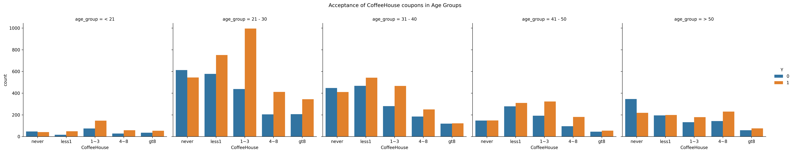
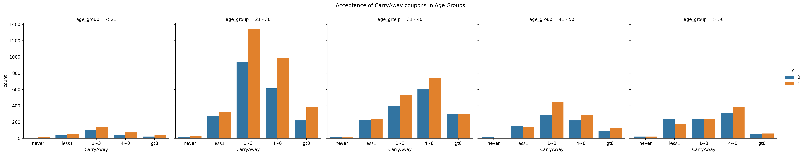
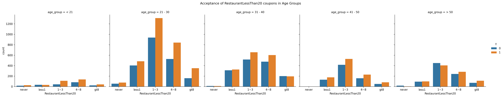
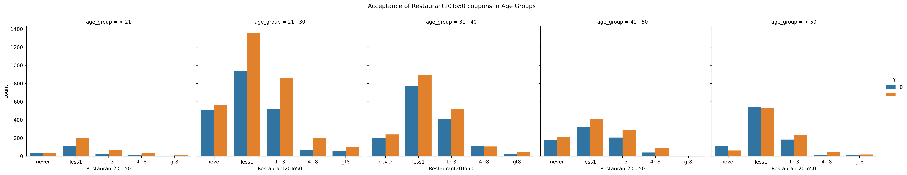

# Coupon Analysis

This repo contains the notebook that analyzes the [coupon data](./data/coupons.csv) and attempts to determine the factors that drive a user to accept or deny the coupon. 
- the analysis is manual and not exhaustive given the number of columns
- applying ML techniques would possibly enhance the analysis, but at the moment that is beyond the scope of this assignment

The notebook is present in this [github repo](./prompt.ipynb) as well as on [google drive](https://colab.research.google.com/drive/1Fm75hjiLj5AfgSSbWp8s4Fu6YLSjDC04?usp=sharing) to be referenced using Google Colab

## Problem Statement (as provided in the notebook prompt)
**Context**

Imagine driving through town and a coupon is delivered to your cell phone for a restaurant near where you are driving. Would you accept that coupon and take a short detour to the restaurant? Would you accept the coupon but use it on a subsequent trip? Would you ignore the coupon entirely? What if the coupon was for a bar instead of a restaurant? What about a coffee house? Would you accept a bar coupon with a minor passenger in the car? What about if it was just you and your partner in the car? Would weather impact the rate of acceptance? What about the time of day?

Obviously, proximity to the business is a factor on whether the coupon is delivered to the driver or not, but what are the factors that determine whether a driver accepts the coupon once it is delivered to them? How would you determine whether a driver is likely to accept a coupon?

**Overview**

The goal of this project is to use what you know about visualizations and probability distributions to distinguish between customers who accepted a driving coupon versus those that did not.

**Data**

This data comes to us from the UCI Machine Learning repository and was collected via a survey on Amazon Mechanical Turk. The survey describes different driving scenarios including the destination, current time, weather, passenger, etc., and then ask the person whether he will accept the coupon if he is the driver. Answers that the user will drive there ‘right away’ or ‘later before the coupon expires’ are labeled as ‘Y = 1’ and answers ‘no, I do not want the coupon’ are labeled as ‘Y = 0’.  There are five different types of coupons -- less expensive restaurants (under \$20), coffee houses, carry out & take away, bar, and more expensive restaurants (\$20 - $50).

**Deliverables**

Your final product should be a brief report that highlights the differences between customers who did and did not accept the coupons.  To explore the data you will utilize your knowledge of plotting, statistical summaries, and visualization using Python. You will publish your findings in a public facing github repository as your first portfolio piece.

## Observations

### Overall
The overall distribution **per coupon type** shows:

- we have maximum data points for *coffee house* and *cheaper restaurants*
- *carryout* and *cheaper restaurants* have a much higher chance of acceptance
- *bars* have a higher chance of rejection
- *coffee houses* and *costly restaurants* have an equal chance

### Temperature
Lets break up the acceptance distribution by temperature:

- in general we have more data points for warmer weather
- in cold weather coupon denial is much higer (except for carryout)
- in warmer weather *cheap restaurants*, and *carrout & take away* acceptance spike up

### Frequency of Visit
Exploring the acceptance rate for Bar coupons based on user's frequency of visit:

| Bar visit | Acceptance Rate |
|:----------|:----------------|
| > 3 | 0.768844 |
| < 3 | 0.370618 |

- people who visit a bar 3 times or more have a much higher chance of accepting a coupon (70%) compared to those who visit less than 3 times

- multi variate 

| Criteria | Rate |
|:---------|:-----|
| bar > once/month & age > 25 | 0.6952 |
| bar > once/month & age < 30 | 0.7217 |
| bar > once/month & passanger != Kids && occupation != Farming/Fishing/Forestry | 0.7132 |
| bar > once/month & passanger != Kids && maritalStatus != Widowed | 0.7132 |

- observations:
	- for the bar scenario, we see people who go to bar > once/month always have ~ 70% probability of accepting the coupon
	- irrespective of whether they are > 25 years, or have non kid as a passenger or if they are < 30 years
	- just going to the bar > once/month increases the odds of accepting the coupon

### Exploring all coupn types for age ranges
Plotting the coupon types seperately for different age groups:

